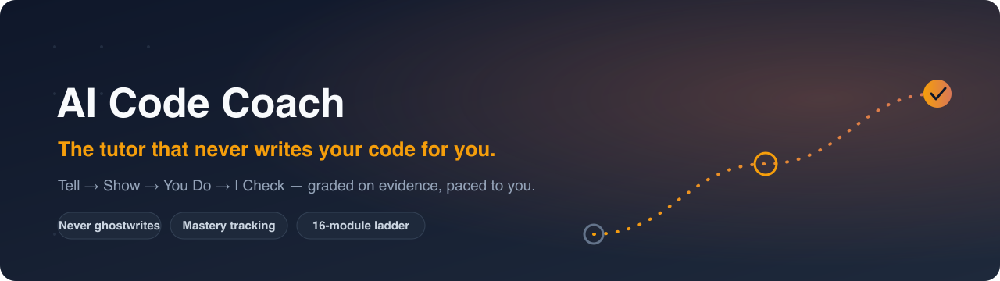

<h1 align="center">Hi, I'm Joe 👋</h1>
<h3 align="center">I build AI-powered products.</h3>

  
  
  
  
  

  

---

## 🤖 AI Code Coach Agent &nbsp;🚧 in active development

An **AI teaching agent that takes a total beginner and turns them into a self-sufficient developer** — someone who can read, write, and explain their own code without an AI writing it for them. It reads what you write, grades it against a real rubric, tracks what you've *actually* mastered, and picks the next lesson from the evidence. A personal tutor that observes, explains, and points the way — but makes **you** write every line.

Built as an adaptive curriculum that runs inside a real terminal, so it can create files, run your code, and read your git and test output the way a mentor sitting next to you would.

**The point: you come in a beginner and leave able to build on your own — you actually learn to write code, not watch an AI do it for you.**

> 📖 **[Read the full case study →](https://github.com/jrletner/ai-code-coach-case-study)** — the design, the pedagogy encoded as enforceable rules, and the file-based architecture.

### What it does

- **🚫 Never ghostwrites — a hard constraint.** The agent will not complete, fill in, or hand over a single line of your code. Mid-exercise help explains the *concept* with a worked example in a **different** domain and different variable names, so the answer can't leak. The real solution appears only in the post-submission review — and trying to fish for it by leaving learn mode doesn't work either.

- **🎓 A four-beat teaching loop.** Every lesson runs **Tell → Show → You Do → I Check**: teach from first principles (jargon defined before use), show a runnable, commented example in a *different* scenario than the exercise, hand you a blank file to write yourself, then run your code and grade the real output against the requirement — because "it ran" is never the same as "it's correct."

- **📊 Evidence-based mastery tracking.** Every skill is scored on a 0–100 rubric (Correctness · Tests · Standards · Readability · Concept grasp) and moved through `not started → learning → practiced → mastered` only on objective evidence: a skill is *mastered* only after **two clean, un-hinted reps on separate, spaced occasions.** No self-certification.

- **🚦 Advancement gates that won't let you skip.** You move past a lesson only when you score ≥ 60 **and** have no blocking skills still below `practiced`. Weak areas trigger targeted re-teaching in a fresh scenario; proven strength triggers acceleration — compress drills, offer a test-out. The pace adapts in **both** directions.

- **🔬 Reads the docs *with* you, not *for* you.** Every library lesson teaches you to decode a real VS Code hover signature into plain English yourself — token by token, rating your own confidence — so your reliance on AI drops instead of growing.

- **📡 No more outdated tutorials. No more deprecated APIs.** Before any library lesson, the current API is pulled *live* from the official docs via **Context7 (MCP)** and pinned to the non-deprecated version — package names verified too, not just methods. You learn the framework as it exists today, not as some three-year-old blog post remembers it.

- **🎚️ Don't like how a lesson lands? Just say so.** Tell the agent how you learn best — visual-first, terse, more examples, slower steps, a different analogy — and it adapts its style, depth, and pace on the fly. The lesson bends to you, not the other way around.

- **📈 Spaced-repetition + adaptive drills.** Standing commands — `drill me`, `leet me`, `test your skills` — pull what's *due* from a spacing schedule and weight toward your current weak spots. A read-only `how am I doing?` gives an honest snapshot of scores, gaps, and what's next, any time.

- **🛡️ Learner guardrails that watch for trouble.** Silent detectors for frustration, copy-paste / AI-submitted work (met with "walk me through line N"), perfectionism (every task is time-boxed), and vocabulary gaps — each one changes *how* the agent teaches on the fly.

- **💼 Taught to what employers are actually hiring for.** A `market check` command pulls live signal from the Stack Overflow Survey, HN "Who is Hiring," roadmap.sh, and LinkedIn job listings, then maps your skills against what AI-app roles are actually hiring for — and weights the curriculum's depth toward high-demand, within-stack skills. You learn where the job market spends its time, not what's merely fashionable.

- **✋ Git stays in your hands.** You run every git command yourself (`git init`, `add`, `commit`, `switch`, `merge`); the agent teaches and verifies but never commits for you. Every submission is your own commit on a feature branch.

- **🗺️ A 16-module curriculum to employment-ready.** A fixed dependency ladder from JavaScript and Git fundamentals through TypeScript, React, full-stack Next.js, databases, auth, testing, security, and CI/CD — ending in a three-app AI portfolio (LLM apps, RAG, and agents) and interview readiness in the AI niche. You ship your first live page in week one.

  

<em>The method: write it yourself first, get coached (never corrected), advance only on evidence.</em>

## 🧰 Tech I work with

**Frontend** — React · Next.js · TypeScript · Tailwind · shadcn/ui
**Backend** — Node · Drizzle ORM · Postgres · MongoDB
**AI** — Vercel AI SDK · Claude · LLM app architecture · prompt engineering

## 🛠 Projects

A few of the repos I also use to teach people to code:

- **[FE_Lectures](https://github.com/jrletner/FE_Lectures)** — Live-coded front-end lessons. *6 student forks.*
- **[react_todo](https://github.com/jrletner/react_todo)** — Full-stack reference app: React + TypeScript + Node/Express + MongoDB.
- **[vanilla_js_todo](https://github.com/jrletner/vanilla_js_todo)** — Framework-free JS fundamentals: DOM, fetch, state, CRUD from scratch.

## 📫 Connect

✉️ jrletner@gmail.com &nbsp;·&nbsp; 💼 [LinkedIn](https://www.linkedin.com/in/joe-letner-4a37ba99/)
