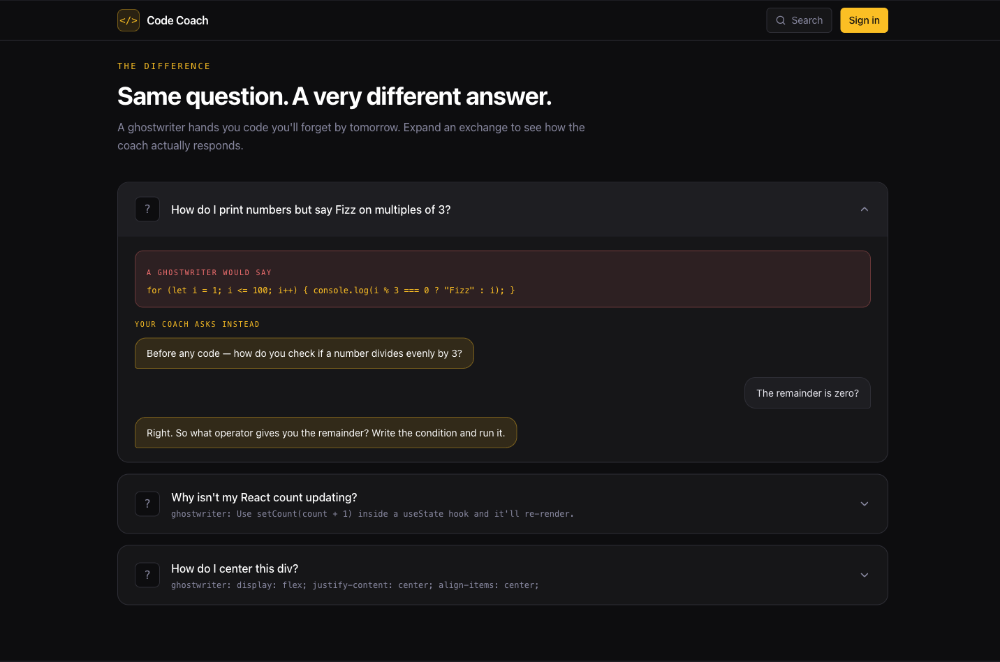

<h1 align="center">Hi, I'm Joe 👋</h1>
<h3 align="center">I build AI-powered products.</h3>

  
  
  
  
  

---

## 🚀 AI Code Coach &nbsp;🚧 in active development

An **AI coding tutor that reads a student's code and coaches them** — it observes, explains, and points the way, but never writes their code for them. I'm building the tutor I wished my own students had.

  

**Built with**

  
  
  
  
  
  
  
  
  

> Private beta in progress — walkthrough available on request.

### How it uses AI to teach

The coaching model *is* the product. The system prompt is engineered around a few hard rules:

- **A no-code hard constraint** — the AI never writes, completes, or fills in a single line of the student's code. It reads their code and gives line-specific observations; any worked example uses a *different* domain and variable names so it can't leak the answer.
- **Socratic by design** — instead of handing over a solution, it asks the next guiding question and lets the student write it. (See the FizzBuzz exchange below.)
- **Adapts to the learner** — selectable learning style (visual, with auto-generated Mermaid diagrams; step-by-step; or Socratic), four skill levels, and a strictness/tone dial from warm-and-encouraging to direct-and-unsparing.
- **Prompt-injection safe** — student code and rendered output are passed to the model strictly as data, never as instructions, so lesson content can't hijack the coach.

  

<em>The method: write it yourself first, get coached (never corrected), tuned to your level.</em>

  

<em>Same question, two answers: a ghostwriter hands over the code; the coach asks what the remainder should be.</em>

## 🧰 Tech I work with

**Frontend** — React · Next.js · TypeScript · Tailwind · shadcn/ui
**Backend** — Node · Drizzle ORM · Postgres · MongoDB
**AI** — Vercel AI SDK · Claude · LLM app architecture · prompt engineering

## 🛠 Projects

A few of the repos I also use to teach people to code:

- **[FE_Lectures](https://github.com/jrletner/FE_Lectures)** — Live-coded front-end lessons. *6 student forks.*
- **[react_todo](https://github.com/jrletner/react_todo)** — Full-stack reference app: React + TypeScript + Node/Express + MongoDB.
- **[vanilla_js_todo](https://github.com/jrletner/vanilla_js_todo)** — Framework-free JS fundamentals: DOM, fetch, state, CRUD from scratch.

## 📫 Connect

✉️ jrletner@gmail.com &nbsp;·&nbsp; 💼 [LinkedIn](https://www.linkedin.com/in/joe-letner-4a37ba99/)
